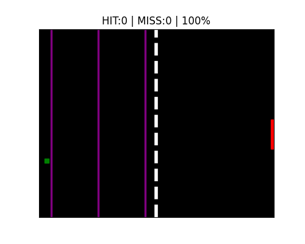

# Neuromuscular-Inspired Control in Pong

<p align="center">
  
</p>

This repository contains code where you can train a neuromuscular-inspired system to play the game of pong. To download the required packages, run:
```
pip install -r requirements.txt
```
 
## Environment
The environment is an adapted environment of the game of Pong. One player needs to intercept the ball, shot from the other side. The ball has one speed, and a random initial angle. The ball is detected using sensor lines, evenly spread across a section of the environment. Sensor line information is propagated through a spiking neural network. Each output neuron is connected to a musclefiber model, which in turn moves the paddle when the neuron spikes. There is an agonist muscle model as wel as an antagonist muscle model. After each trial the error is measured, and the SNN weights are updated using a spiking version of [direct feedback alignment](https://arxiv.org/abs/1609.01596).

<p align="center">
    
</p>

## Information Encoding
Sensor line information is encoded using Gaussian encoding. Several Gaussians with a predefined receptive field encode ball crossing heights. The means of the Gaussians are equally spaced, and each Gaussian is connected to a single neuron. The neuron probablistically spikes with probability h/Θ, where h is the crossing height of the ball and Θ is the neuron threshold.

## Spiking Neural Network
The spiking neural network consists of 3 layers. The first layer consists of probablistic neurons, the last two consist of integrate and fire neurons. 

## Output
The output consists of muscle-fiber models, one for every output neuron. The models are second-order impulse response filter and will generate a bump at every output spike. The sum of bump values at time t is the velocity of the paddle v(t). 

## Learning
Learning is performed using a spiking version of DFA. The error per output neuron consists of the global error E, the sum of output spikes p, and the amplitude of the connected muscle fiber A, In the form: $e=E*p*A$. A vector of individual errors is multiplied with a randomly initialized feedback matrix B, and inputs to the corresponding weight matrix that is to be updated. 

## Training & Visualizing
To train the network, run:
``` 
./train/train.py
```
To visualize the learning curve, run:
```
./plotting/plothitrate.py
```
This will generate "parameter_error_table.txt", which can be used to make the other plots. 

To plot a histogram of performances, run:
```
./plotting/plotPerformanceHistogram.py
```
To plot a heatmap of performances, run:
```
./plotting/plotcombinationmatrix_circle.py
```
To visualize the game with trained paramters, run:
```
Visualization/visualize_game.py
```

There are two additional tools. One tool where you can see the uncertainty of the ball's end position given initial conditions when using positional encoding without overlap (so no Gaussian receptive fields for example). This can be run with:
```
./Visualization/visualize_game.py
```

Additionally, you can visualize the Gaussian receptive fields with:
```
./Vsiualization/visualize_gaussian_encoding.py
```

## Links
[The repository](https://github.com/JordiTi/NeuromorphicPongControl)


