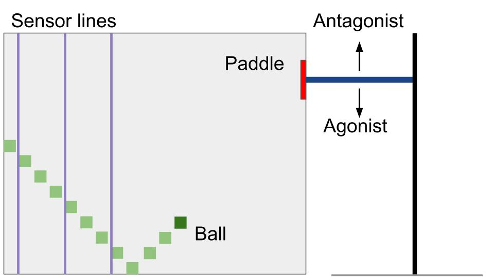

# Neuromuscular-inspired control in Pong

## Encoding

## Neural network

https://github.com/JordiTi/NeuromorphicPongControl

## Image generation
This section describes how all the result images are generated.  
The images are generated from data received after training. When training is finished, a folder called "errorfiles" is generated. Create two directories in this folder: "data" and "plots". Move the files inside the data folder.  
Run "plothitrate_singletrails.py" 
"parameter_error_table.txt" is generated   
For figures 3a-5a: 
Run plotPerformanceHistogram.py 
For figures 3b-5b: 
Run plotcombinationmatrix_circle.py

